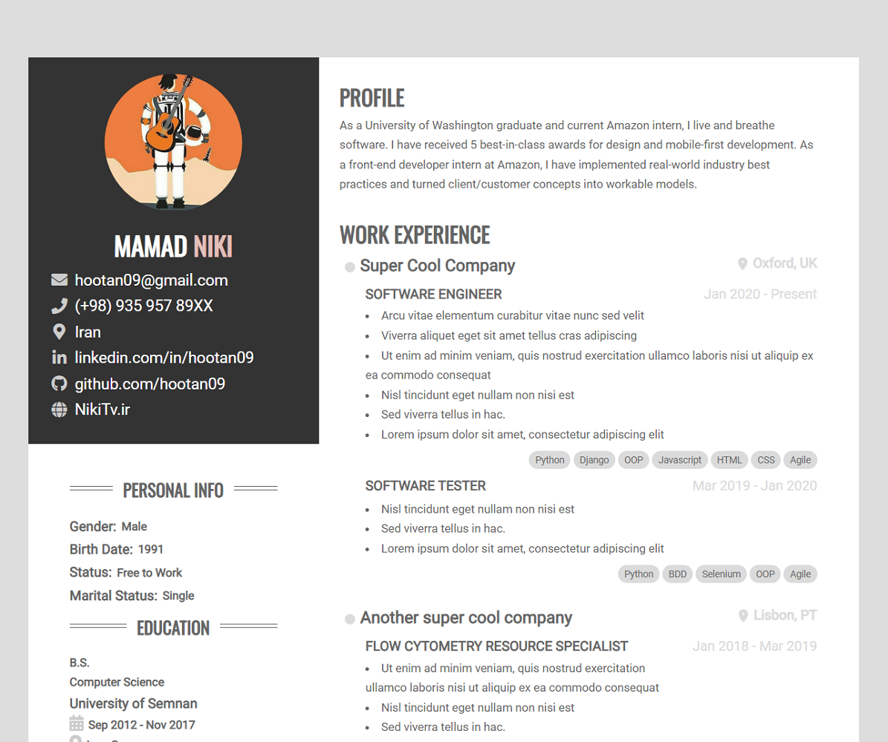

# Simple CV Theme
Theme to build a customizeable printable HTML/CSS CV.

### [Forked From Orginal Repo almeida-cv](https://github.com/ineesalmeida/almeida-cv)



# Features
 - Online CV with minor responsiveness
 - Printable as A4 PDF
 - HTML5 + CSS3
 - Customizeable colors

## Print your PDF CV
When printing the page in the browser, you'll get a formatted A4 page that can be used as your PDF resume.
If your page holds more than 1 A4 page, the content will be divided into the given amount of pages.

For better formatting, you can set the number of pages in the `config.toml` file.

If badges and other elements with background don't render correctly, remember to toggle the "Background Graphics" option in the print dialog.

# Usage
## Install Hugo (extended)
To use `simple-cv` theme you need to install Hugo Extended by following https://gohugo.io/getting-started/installing/.

## Create your personal website
```
hugo new site <your website's name>
cd <your website's name>
git init
git submodule add https://github.com/hootan09/simple-cv.git themes/simple-cv
```
Replace the files in your site root's directory with the ones in `themes/simple-cv/exampleSite`.

## Start Hugo in development mode
```
hugo server -D
```
Your site is now available at http://localhost:1313/.

## Customization
Your professional data should be added in the `data/content.yaml` file. You can change the theme colors and number of
pages in the `config.toml` file. For working example, see `exampleSite` directory.

For more advanced customization, in your site root directory create `assets/scss/_custom.scss` file where you can
overwrite theme SCSS as per your liking.

## Building
To generate static files of your website, execute the following:
```
hugo --minify
```
within the root of your project.

# Contributing
Post bugs and contributions to the issue tracker. Or make a pull request.
